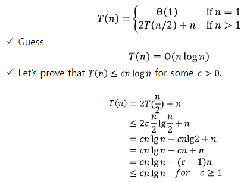
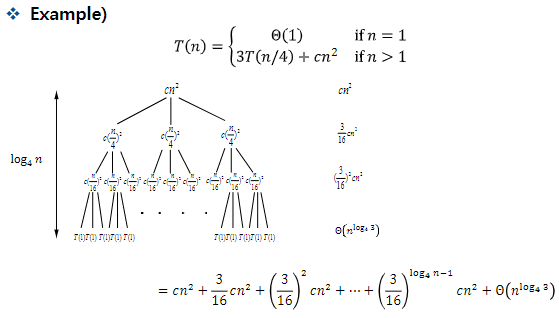
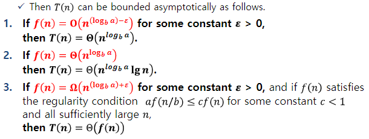
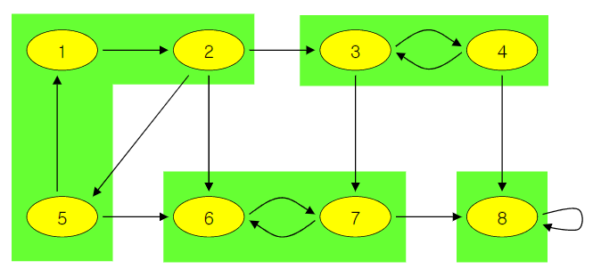

# ECE30005-02-Algorithms-Analysis

## 2. Growth of Functions
### O-notation
$O(g(n))$은 모든 $n>=n_0$에서 $0<=f(n)<=cg(n)$을 만족하는 $c (c>0)$와 $n_0$이 있을 때 $f(n)$의 집합

ex) $2n^2 = O(n^3)$, with $c=1$ and $n_0 = 2$

### $\Omega$-notation
$\Omega(g(n))$은 모든 $n>=n_0$에서 $0<=cg(n)<=f(n)$을 만족하는 $c (c>0)$와 $n_0$이 있을 때 $f(n)$의 집합

ex) $\sqrt(n) = \Omega(lgn)$, with $c=1$ and $n_0 = 16$

### $\Theta$ -notation
$\Theta(g(n))$은 모든 $n>=n_0$에서 $0<=c_1g(n)<=f(n)<=c_2g(n)$을 만족하는 $c_1, c_2 (c_1>0, c_2>0)$와 $n_0$이 있을 때 $f(n)$의 집합

ex) $n^2/2-2n = \Theta(n^2)$, with $c_1=1/4$, $c_2=1/2$ and $n_0 = 8$

### o-notation
o(g(n))은 어떤 c>0에서든지 모든 $n>=n_0$에서 $0 <= f(n) < cg(n)$을 만족하는 $n_0>0$이 존재할 때 
$f(n)$의 집합

$o(f)=O(f)-\theta(f)$

### $\omega$-notation
$\omega$(g(n))은 어떤 c>0에서든지 모든 $n>=n_0$에서 $0 <= cg(n) < f(n)$을 만족하는 $n_0>0$이 존재할 때 $f(n)$의 집합

$\omega(f)=\Omega(f)-\theta(f)$

$g(n)=o(f(n))$ <=> $f(n)=\omega(g(n))$

### Proposition
1. $f(n)\in\Theta(f(n))$
2. $f(n)\in\Theta(g(n))$ <=> $g(n)\in\Theta(f(n))$
3. $f(n)\in\Theta(g(n))$ and $g(n)\in\Theta(h(n))$ => $f(n)\in\Theta(h(n))$

### 알고리즘의 시간복잡도
$O(n^2)$: 알고리즘의 worst case    
$\Omega(n^2)$: 알고리즘의 best case    
$\theta(n^2)$: 위의 2개 

- - -

## 3. Divide and Conquer
### Recurrence vs Recursion
재귀(recursion)와 순환(recurrence)은 컴퓨터 과학과 수학에서 관련된 개념입니다. 그러나 두 개념은 서로 다릅니다.

순환(recurrence)은 이전 값에 기반하여 정의된 숫자나 다른 객체의 시퀀스를 나타냅니다. 흔한 예로는 각 항이 이전 두 항의 합인 피보나치 수열이 있습니다. 순환 관계는 해석적 또는 수치적으로 해결되어 시퀀스의 값을 임의의 인덱스에 대해 찾을 수 있습니다.

재귀(recursion)는 함수가 자신을 호출하여 문제를 해결하는 프로그래밍 기술을 말합니다. 함수는 일반적으로 기본 사례(base case)와 재귀적 사례(recursive case)를 가지며, 기본 사례는 직접 해결할 수 있는 간단한 경우이고, 재귀적 사례는 문제를 작은 하위 문제로 분해하고 재귀적으로 해결합니다. 재귀는 일반적으로 트리를 탐색하거나 팩토리얼을 계산하는 등 자연스러운 재귀적 구조를 가진 문제를 해결하는 데 사용됩니다.

따라서, 재귀와 순환 모두 이전 값이나 작은 하위 문제에 기반하여 문제를 정의하는 것은 유사하지만, 서로 다른 개념이며 다른 응용 분야가 있습니다.

- ChatGPT 참조

### Solving recurrence equations

1. Iteration method   
이건 걍 귀납법(Inductive Hypothesis)이다.
2. Substitution method   

3. Recursion-tree method   
   
위처럼 등비수열 같이 계산하면 된다.
4. Master method   
$T(n) = aT(n/b)+f(n)$에서 a, b와 $f(n)$를 비교하는 방법이다.

- - -

## 4. Dynamic Programming

## 10. Elementary Graph Algorithms

- Vertex or Node
  - 그래프의 동그라미들
  - Adjacent nodes: 연결된 노드들
- Edge (= Arc)
  - 연결하는 선
- Graph
  - Directed or undirected
  - Weighted or not weighted
  - directed는 self connect가 가능하지만 undirected는 그렇지 않다
  - 두 node 사이를 연결하는 edge는 여러개가 될 수 없다
- Symmetric digraph
  - 대칭 그래프 : 모든 edge의 reverse edge도 존재하는 그래프
- Complete graphs
  - 모든 node에 연결 가능한 모든 edge가 연결되어 있는 것
- Path
  - 연결된 노드들을 모은 집합
  - simple한 P는 Path의 node들을 다 이을 Path가 P가 유일할 때
- Cycle
  - Path와 비슷하지만 처음과 마지막이 이어져 있음
- Subgraph
  - H = (W,F)가 G = (V, E)의 subgraph일 때
  - V의 부분집합은 W이고, E의 부분집합은 F이다.
- Spanning graph
  - subgraph지만 부모 그래프의 모든 node를 가지고 있는 graph
- connected
  - graph G가 connected 하다는 것은 G의 어떤 두 node도 path를 통해 연결 가능
  - connected componentes는 한 그래프의 덩어리(?)라고 보면 됨
- Strongly connected digraph
  - directed graph에서 node u가 v에 reachable한다면, v도 u에 reachable한 것

- Directed acyclic graph
  - DAG이라고 부름 (acyclic = no-cycles)
- - -
- Tree
  - cycle을 포함하지 않은 graph
  - Spanning Tree : 한 graph의 모든 node를 연결하는 tree