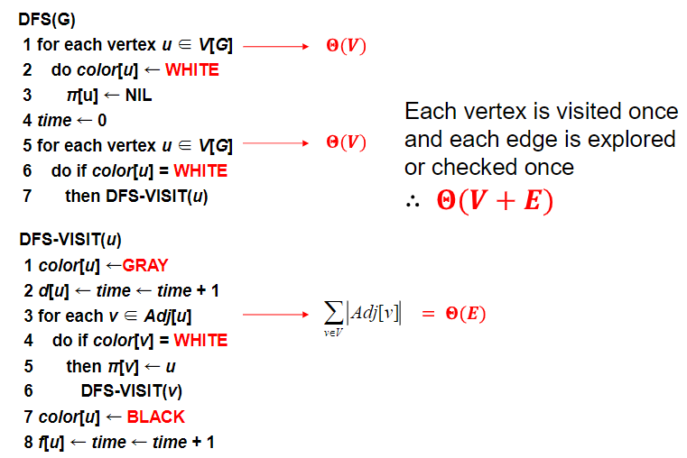

# ECE30005-02-Algorithms-Analysis

## 2. Growth of Functions
### O-notation
$O(g(n))$은 모든 $n>=n_0$에서 $0<=f(n)<=cg(n)$을 만족하는 $c (c>0)$와 $n_0$이 있을 때 $f(n)$의 집합

ex) $2n^2 = O(n^3)$, with $c=1$ and $n_0 = 2$

### $\Omega$-notation
$\Omega(g(n))$은 모든 $n>=n_0$에서 $0<=cg(n)<=f(n)$을 만족하는 $c (c>0)$와 $n_0$이 있을 때 $f(n)$의 집합

ex) $\sqrt(n) = \Omega(lgn)$, with $c=1$ and $n_0 = 16$

### $\Theta$ -notation
$\Theta(g(n))$은 모든 $n>=n_0$에서 $0<=c_1g(n)<=f(n)<=c_2g(n)$을 만족하는 $c_1, c_2 (c_1>0, c_2>0)$와 $n_0$이 있을 때 $f(n)$의 집합

ex) $n^2/2-2n = \Theta(n^2)$, with $c_1=1/4$, $c_2=1/2$ and $n_0 = 8$

### o-notation
o(g(n))은 어떤 c>0에서든지 모든 $n>=n_0$에서 $0 <= f(n) < cg(n)$을 만족하는 $n_0>0$이 존재할 때 
$f(n)$의 집합

$o(f)=O(f)-\theta(f)$

### $\omega$-notation
$\omega$(g(n))은 어떤 c>0에서든지 모든 $n>=n_0$에서 $0 <= cg(n) < f(n)$을 만족하는 $n_0>0$이 존재할 때 $f(n)$의 집합

$\omega(f)=\Omega(f)-\theta(f)$

$g(n)=o(f(n))$ <=> $f(n)=\omega(g(n))$

### Proposition
1. $f(n)\in\Theta(f(n))$
2. $f(n)\in\Theta(g(n))$ <=> $g(n)\in\Theta(f(n))$
3. $f(n)\in\Theta(g(n))$ and $g(n)\in\Theta(h(n))$ => $f(n)\in\Theta(h(n))$

### 알고리즘의 시간복잡도
$O(n^2)$: 알고리즘의 worst case    
$\Omega(n^2)$: 알고리즘의 best case    
$\theta(n^2)$: 위의 2개 

- - -

## 3. Divide and Conquer
### Recurrence vs Recursion
재귀(recursion)와 순환(recurrence)은 컴퓨터 과학과 수학에서 관련된 개념입니다. 그러나 두 개념은 서로 다릅니다.

순환(recurrence)은 이전 값에 기반하여 정의된 숫자나 다른 객체의 시퀀스를 나타냅니다. 흔한 예로는 각 항이 이전 두 항의 합인 피보나치 수열이 있습니다. 순환 관계는 해석적 또는 수치적으로 해결되어 시퀀스의 값을 임의의 인덱스에 대해 찾을 수 있습니다.

재귀(recursion)는 함수가 자신을 호출하여 문제를 해결하는 프로그래밍 기술을 말합니다. 함수는 일반적으로 기본 사례(base case)와 재귀적 사례(recursive case)를 가지며, 기본 사례는 직접 해결할 수 있는 간단한 경우이고, 재귀적 사례는 문제를 작은 하위 문제로 분해하고 재귀적으로 해결합니다. 재귀는 일반적으로 트리를 탐색하거나 팩토리얼을 계산하는 등 자연스러운 재귀적 구조를 가진 문제를 해결하는 데 사용됩니다.

따라서, 재귀와 순환 모두 이전 값이나 작은 하위 문제에 기반하여 문제를 정의하는 것은 유사하지만, 서로 다른 개념이며 다른 응용 분야가 있습니다.

- ChatGPT 참조

### Solving recurrence equations

1. Iteration method   
이건 걍 귀납법(Inductive Hypothesis)이다.
2. Substitution method   

3. Recursion-tree method   
   
위처럼 등비수열 같이 계산하면 된다.
4. Master method   
$T(n) = aT(n/b)+f(n)$에서 a, b와 $f(n)$를 비교하는 방법이다.

- - -

## 10. Elementary Graph Algorithms

- Vertex or Node
  - 그래프의 동그라미들
  - Adjacent nodes: 연결된 노드들
- Edge (= Arc)
  - 연결하는 선
- Graph
  - Directed or undirected
  - Weighted or not weighted
  - directed는 self connect가 가능하지만 undirected는 그렇지 않다
  - 두 node 사이를 연결하는 edge는 여러개가 될 수 없다
- Symmetric digraph
  - 대칭 그래프 : 모든 edge의 reverse edge도 존재하는 그래프
- Complete graphs
  - 모든 node에 연결 가능한 모든 edge가 연결되어 있는 것
- Path
  - 연결된 노드들을 모은 집합
  - simple한 P는 Path의 node들을 다 이을 Path가 P가 유일할 때
- Cycle
  - Path와 비슷하지만 처음과 마지막이 이어져 있음
- Subgraph
  - H = (W,F)가 G = (V, E)의 subgraph일 때
  - V의 부분집합은 W이고, E의 부분집합은 F이다.
- Spanning graph
  - subgraph지만 부모 그래프의 모든 node를 가지고 있는 graph
- connected
  - graph G가 connected 하다는 것은 G의 어떤 두 node도 path를 통해 연결 가능
  - connected componentes는 한 그래프의 덩어리(?)라고 보면 됨
- Strongly connected digraph
  - directed graph에서 node u가 v에 reachable한다면, v도 u에 reachable한 것

- Directed acyclic graph
  - DAG이라고 부름 (acyclic = no-cycles)
- - -
- Tree
  - cycle을 포함하지 않은 graph
  - Spanning Tree : 한 graph의 모든 node를 연결하는 tree
- Adjacency Matrix

  - undirect라면 대각선 기준으로 대칭이고
  - weight라면 1 대신 weight가 들어감
  - $O(V^2)$만큼 저장공간 필요
  - 4개의 node를 가진 undirected graph의 adjacency matrix를 저장하기 위해선 최소 몇 bit 필요한가? : 대각 성분 무시, 대칭되는 하삼각행렬 무시하면 4x4에서 상삼각행렬의 개수인 6개만 필요함 즉, 6 bits
  - 보통 밀도가 높은 graph일 때 선호된다 (크기만 한 graph라면 저장공간 너무 잡아먹음) (small graph일 때 효율적임)
- Array of Adjacency List Representation

- - -

## 11. BFS

### Process

....

### Code

### Running time
- 각 node를 하나씩 enqueue (white -> gray) : $\Theta(V)$
- 각 node를 하나씩 dequeue (gray -> black) : $\Theta(V)$
- 각 인접 리스트를 하나씩 스캔              : $\Theta(E)$

총 running time : $\Theta(V + E)$

- - -

## 12. DFS

### Process

...

...

...

...

### Code

- Tree edges : DFS 조사하는 경로
  - gray -> white
- Back edges : Tree edges의 반대 순서로 거슬러 올라가는 edge
  - gray -> gray
- Forward edges : Tree edges의 순서대로지만 Tree edges가 아닌 edge
- Cross edges : tree와 subtree 사이를 잇는 edge
  - gray -> black

## 13. DFS 2

   
for문에서 자식노드를 모두   
검사하기 전에는 d[u]에 discovery time 저장   
검사한 후에는 f[u]에 finish time 저장

- v is a descendant of u

- disjoint intervals

### undirected graph의 DFS
- 가능할까?
  - 한 번 쓴 edge는 더 이상 쓰지 않는다는 가정하에 쓸 수 있다.
- tree edges와 back edges만 생성한다.

### Application of DFS
1. Topological Sort
2. Finding Connected Component (Undirected)
3. Finding Strongly Connected Component (Directed)
4. Critical Path Analysis
5. Biconnected Component (Articulation point) Problem

### 1. Topological Sort

   
증명해보자
- (u,v)가 검색됐다면, u는 gray이다.
  - v가 gray이라면 : (u,v)는 back edge (DAG라 cycle이 없어서)
  - v가 white라면  : v는 descendent of u이 되므로 f[v] < f[u]
  - v가 black이라면: v는 이미 끝났으니 f[v] < f[u]

### 2. Connected Components

그냥 DFS id=1로 쭉 찾고 다 찾았으면 id=2로 찾고 반복하면 id개수가 답임

### 3. Strongly Connected Component
   
이것이 원래 $G$라면

   
이게 $G^T$이다.

   
그리고 SCC는 덩어리채로 이렇게 DAG로 표현 가능하다.   

DFS(G)를 해서 finish time을 계산해놓는다.   

DFS($G^T$)를 한다 (단, f[u]는 역순으로)   

그럼 이렇게 나눠진다.

## 14. DFS 3

### 3. Strongly Connected Component (Continued)

그 알고리즘은 running time이 $\Theta(V + E)$이다.

- Lemma 22.13

  - u -> u'이 있다면 v' -> v는 없다는 거
- Lemma 22.14

  - u -> v라면 C에서 가장 늦게 끝나는 것은 C'에서 가장 늦게 끝나는 것보다 늦게 끝남
- Corollary

## 16. Shortest Paths

### Single Source Shortest path Algorithm

$d[v]$ 는 v까지의 최단 경로 추정 값임 (백준 문제 풀 때 min 변수 하나 잡아두고 계속 갱신하잖아 그거임)   
$\pi[v]$ 는 최단 경로가 어디인지 저장해두는 거임   

- 왼쪽 : $\pi[v] = t$ 였다가 $\pi[v] = u$로 바뀐 것
- 오른쪽 : $\pi[v] = t$인데 Relax해도 여전히 $\pi[v] = t$

### Bellman-Ford Algorithm

negative edge가 있는 그래프에서 SSP 찾는 것이 목적!   
negative-weight cycle이 있다면 **false**   
없다면 **true**

   
init하고 각 node 출발점 삼아 Relax 함수 돌리는 걸 반복해서 모든 node를 다 돌려본다. 다시 돌렸을 때 또 relax된다면 negative-weight cycle이 있다는 뜻! -> return false

시간복잡도 $O(VE)$

### Dijkstra's Algorithm

   
시작 노드에서 이을 수 있는 가지는 다 잇는다.   

(1) 그 이은 가지들 중 가장 최솟값인 가지로 이동 (9, 14, 15에서 9)   

   
(2) 이동해서 가지 다 잇는다. 3(33)   

(1) 다시 최솟값인 가지로 이동

(2) 또 가지를 다 잇는다.

(1)과 (2)를 반복   

## 17. Shortest Path 2

[플로이드 워샬](https://victorydntmd.tistory.com/108)

## 18. Heapsort

### Heap
- Heap

완전 이진트리에 가까움, 빈 슬롯은 null pointer

- Heap to array

  - root node : $A[1]$
  - Node i : $A[i]$
  - Node i의 parent : $A[floor(i/2)]$
  - Node i의 left child : $A[2i]$
  - Node i의 right child : $A[2i+1]$
- Height
  - height : $log_2n$
- Max-Heapify

  - algorithm

- Worst case of Heapify
  - 한쪽에 leaf node 다 있고 한 쪽엔 다 없어서 왼쪽이 2/3의 비중을 가질 때

  - Master Theorem case 2에 의해 $T(n) = O($lg$n)$
- Build-Max-Heap(A)

  - for i = [n/2] downto 1
    - do Max-Heapify(A,i)

## 19. QuickSort

### Divide and Conquer

피봇 x를 기준으로 양 옆으로 나눠서 정렬하고 양 옆 블록을 다시 재귀해서 처리

### Worst case of quicksort

- 저 $\Theta(n)$은 Partitioning cost이다.

### Best case of quicksort

## 21. Order Statistics & Red-Black Trees

## 22. NP-Completeness

### Hardness of Problems

모든 알고리즘은 다항시간(polynomial-time)안에 풀린다 안 풀린다로 나뉨.   
Tractable : 어렵지 않음   
Intractable : 어려움, 시간 오래걸림 (다항시간 아님)   
Difficult Problem(NP)이 있는데 다항시간 안에 풀리지 않으면 일단 Tractable은 아님, 그렇다고 Intractable이라고 확정지을 수는 없음. 

TSP(Traveling Salesperson Problem)는 $O(n2^n)$로 풀릴 수 있음 = Tractable   
Clique는 $O(n2^n)$로 풀릴 수 있음 = Tractable   

### The Class P

풀기 쉬움   
결정 문제(decision problem) : 예, 아니오로 해결 가능한 문제

### The Class NP

풀기 어렵지만 검산은 쉬움
NP는 non-deterministic polynomial이지 not polynomial이라는 뜻이 아니다!

### Some Terminologies

#### Optimization problem
Hamiltonian cycle: a graph cycle that visits each node exactly once

#### Decision problem
k가 주어진다면 총 중량이 최대 k인 해밀턴 사이클이 있는가?   
처럼 Yes or No 로 답이 정해지는 문제

#### Deterministic

#### Nondeterministic

### 아무도 P = NP인지 P ⊂ NP인지 모름

### Reducibility
문제 A: 주어진 n개의 숫자를 크기 순서로 정렬하는 문제   
문제 B: 주어진 n개 숫자의 중간값을 계산하는 문제   
B를 A로 환원시킬 수 있다(reducible).

### NP-hard & NP-Complete

NP-hard : 적어도 NP문제 보다는 어려우며, “모든” NP 문제를 다항 시간 내에 어떤 문제 A로 환원(reduction)할 수 있다면, 그 A 문제를 NP-난해(NP-hard) 문제라고 한다.   
NP-Complete : NP-hard문제이면서 NP문제라는 것은 가장 어려운 NP문제이면서도 '풀수 있는'문제라는 것이다.   
그래서 NP-Complete를 풀면 P=NP가 증명된다.

참조 : https://wkdtjsgur100.github.io/P-NP/

P ⊂ NP라면   
   
P = NP라면   
   

CNF-Satisfiable 문제는 NP-완전 문제이다.

시험 범위 22장 22쪽까지

